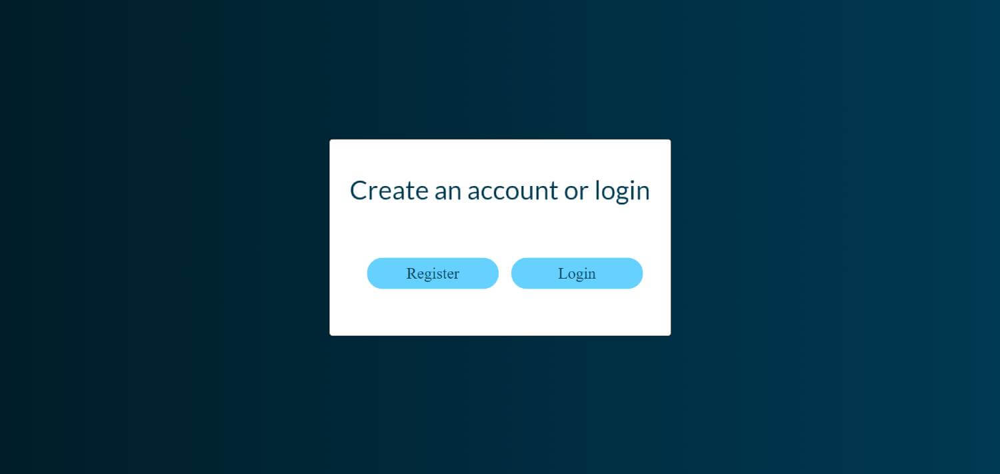
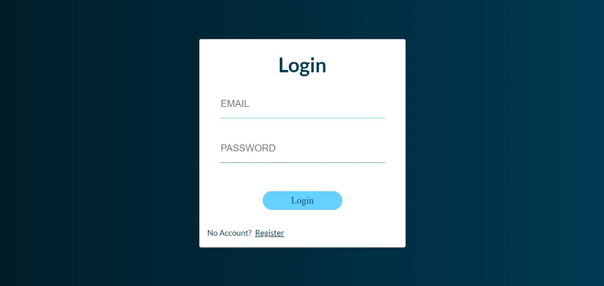
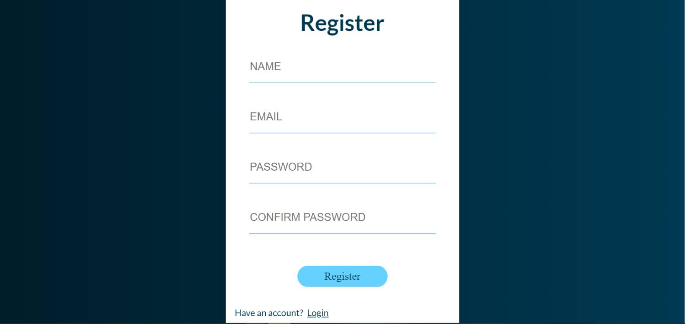
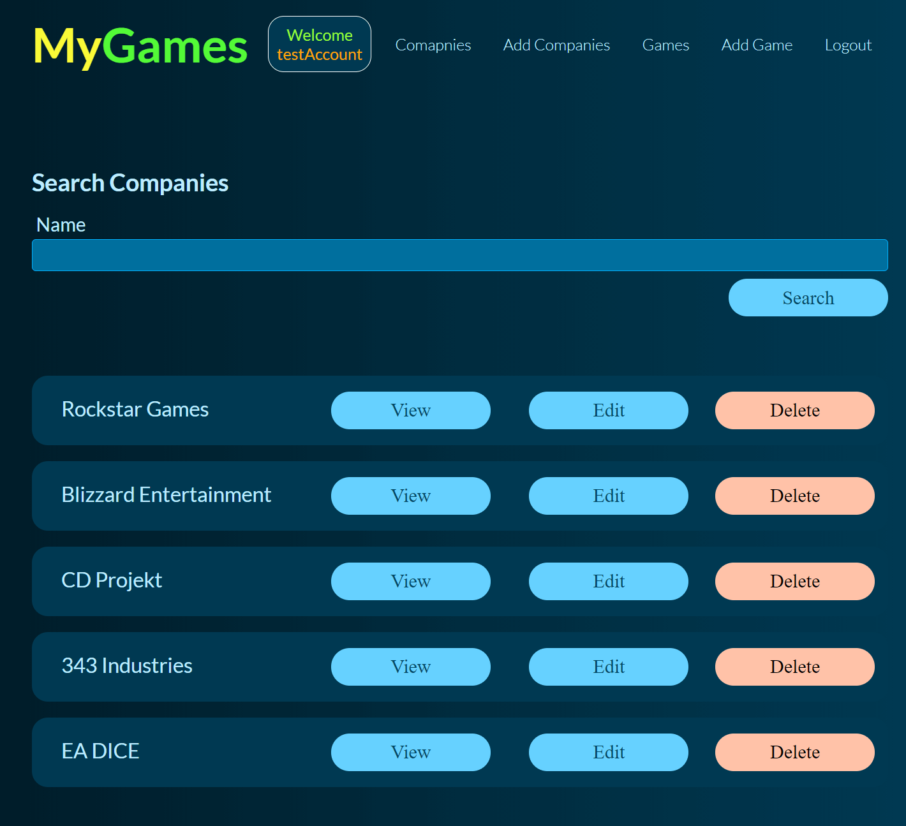
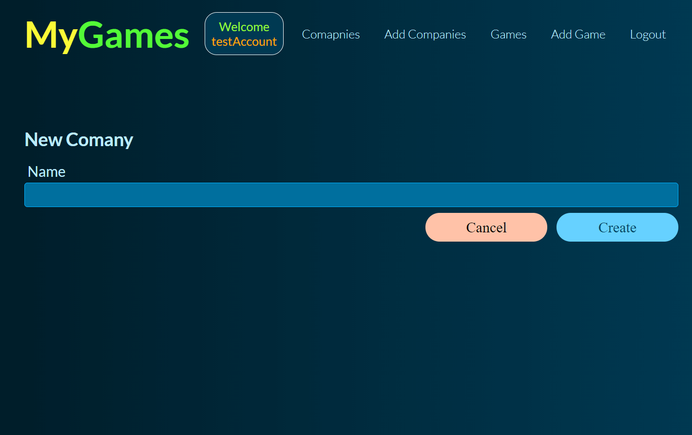
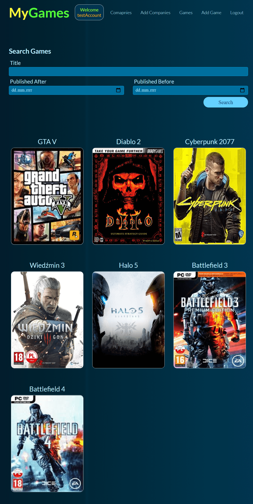
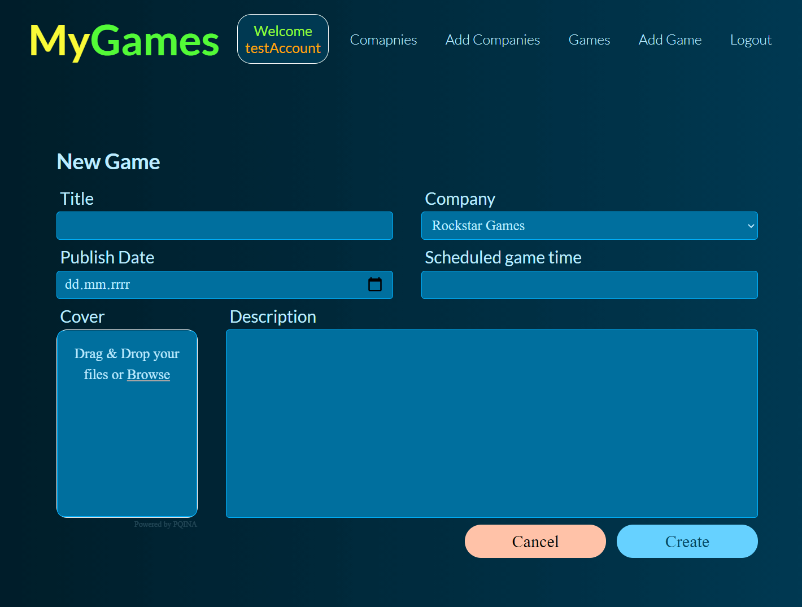
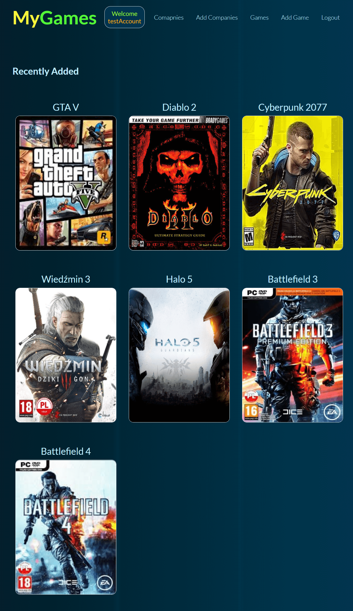
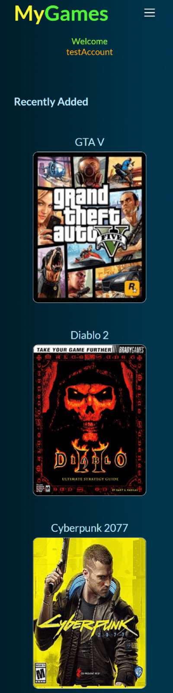

# REST API - GAMES MENAGER
> This is my first fully responsive REST API application where you can create your own game library.
>
> We have the option of registering, logging in to your individual account and adding / removing / editing games and their developers.
>
> All data is stored in the cloud on a non-relational database [MongoDB](https://www.mongodb.com/).
>
> The application works on the free cloud platform [Heroku](https://www.heroku.com/), which is associated with a few seconds of waiting for the application to start.
>
> Each new user who registers in the application has descriptions of games and companies created by default to his account.
>
> [Link to MyGames](https://myapi-library.herokuapp.com/)

## Table of contents
* [General info](#general-info)
* [Screenshots](#screenshots)
* [Technologies](#technologies)
* [Extends](#extends)
* [Status](#status)
* [Contact](#contact)

## General info
I created the application for training purposes after completing the courses on REST API, registration / login.

## Screenshots

***

***

***

***

***

***

***

***

## Technologies
* CSS- version 3
* HTML - version 5
* JavaScript
* Node.js
* MongoDB

### Extends
* mongoose.js
* express.js
* ejs
* passport.js
* Joi.js
* fileUpload.js
* bcrypt.js
* connect-flash.js
* and a few other smaller packages

## Status
Project is: _finished_

## Contact
Created by [@Grzegorz Stącel](mailto:stacelgrzegorz@gmail.com) - feel free to contact me!
